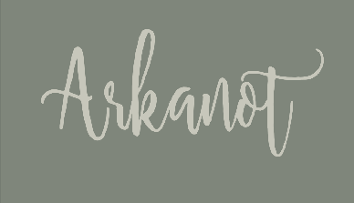
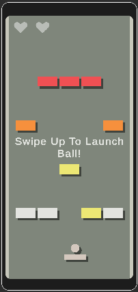

# Overview
A minimalist clone of the beloved game Arkanoid targeted for android and built in Unity. Developed for a coding challenge.

- Like the original the objective of the game is to clear all the bricks
- You control a paddle and you lose a heart when the ball falls to the void
- Some bricks take more than one hit to destroy (based on color)
- Power ups are available
- Level progression is sequential (ie. next level gets unlocked if you beat the current one)

# Sections
- [Overview](#overview)
- [Sections](#sections)
- [Technical Overview](#technical-overview)
  - [Level Scene Hierarchy](#level-scene-hierarchy)
  - [Home](#home)
  - [Level Selection](#level-selection)
  - [Data](#data)
  - [Input](#input)
- [How To Create A Level](#how-to-create-a-level)
- [Future Improvements / TODO](#future-improvements--todo)
- [Dependencies and Attributions](#dependencies-and-attributions)

# Technical Overview

This section will give a ***brief*** technical overview. For in depth implementation details please refer to the codebase. 

## Level Scene Hierarchy

Below is a representation of the Gameobject hierarchy for a level

- Game Controller
  - Main Camera
  - Win Effect - A particle effect that goes off in the win state
  - Actors
    - Paddle - The "player" if you will
    - Walls - Need something to bounce off. Note: this has the *void* as a child also
  - UI
    - Game End Canvas - includes *GameOver* Text and end game *buttons*
    - HUD Canvas - HUD UI such as Hearts display
    - Launch Hint Canvas - has the swipe up animation in world space
    - Level Intro Canvas - Shows the level name on level start
  - Brick List - All bricks in the level must be placed as a child of this object

Everything is parented under a Game Controller object that is a prefab. The reason for this is to avoid having to change references in every level upon refactoring. Keep in mind that the only thing that changes between levels is:
- The children under brick list
- The level number in Game Controller inspector

More on creating your own level in [How To Create A Level](#how-to-create-a-level)

## Home

The Home Scene consists of 3 elements:
- An intro animation made with Unity's animator
- A set of 3 buttons 
- An *info* panel

## Level Selection

The level selector follows a fairly common pattern. We have a *Level Selection Button* prefab which is spawned dynamically based on the current *Level Progress Data*. The button is spawned into a scroll view with a grid layout group.

The result is a display of all *unlocked* levels and their respective scores.

## Data

Due to the scope of the project, a simple **PlayerPrefs** system was implemented. A static class **LevelProgressData** is responsible for handling the data. A kind of **PlayerPrefs** wrapper if you will.

## Input

The input in *Arkanot* was designed exclusively for mobile. The Input classes are fairly simple as the game only needs to detect the following inputs:

- UI Tap
  - Handled by Unity's internal *Event System*
- Convert Touch coordinates to world input for paddle movement
- Swipe up gesture for start game

With the exception of Unity's internal *Event System* the custom input classes are built to be easily testable.

# How To Create A Level

A level can be created in 8 simple steps
1. Duplicate Assets/_Arkanot/Scenes/Testing/Level Template.unity
2. Name it **"Level {level number}"** and place it in Assets/_Arkanot/Scenes/Levels to stay organized
3. Open it and select the **== Game Controller ==** object
4. Edit the field **Level Number** to your new level number
5. Go to Assets/_Arkanot/Prefabs/Brick Types/ to find all the brick prefabs
6. Place the prefab bricks in your level to your liking!
7. Just **Remember** when you are done to place all the bricks as a child of  **Brick List (Place Bricks Here)**
8. Save the scene and add it to the **Build Settings**

You are done! Enjoy your custom level!

# Future Improvements / TODO

- [ ] Add a back to selection screen button in-game
- [ ] Add a current power up display
- [ ] A level building feature would be really cool
- [ ] Add sound fx
- [ ] Add Music
- [ ] More Unit Tests

# Dependencies and Attributions

- Arkanot uses the [Dotween](http://dotween.demigiant.com/) library to handle all in game tweens.
  - [Dotween](http://dotween.demigiant.com/) is a fast, efficient, fully type-safe object-oriented animation engine for Unity.
- A modified spritesheet of [simple icon pastel tone](https://assetstore.unity.com/packages/2d/gui/icons/simple-icon-pastel-tone-107568) is used for the icons in Arkanot
- Using default fonts is boring right? [Shellahera Script Font](https://www.fontspace.com/shellahera-script-font-f23405) is used for all text
  - hindsight 20/20 its rather hard to read!
